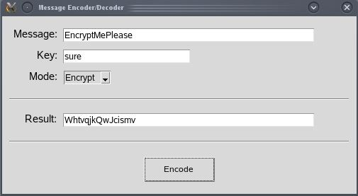
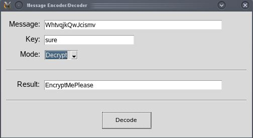

# Message-Encode-Decode
This application encodes/decodes given message with a given key using the Vigenere cipher.
Written in Python3.

Made by [Eugeny Khanchin](https://github.com/eKhanchin) as a personal project.

## Screenshots

